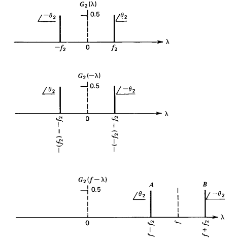

# Mixer

Objetiva-se projetar um mixer para receber o sinal em RF e, utilizando um oscilador local com intervalo de frequências de 108 a 136,9917 MHz.

O objetivo do mixer é deslocar a frequência do sinal que chega da antena, de forma a gerar o sinal em banda-base. Para um mixer de frequências de oscilador $f_{LO}$ e frequência de sinal RF $f_{RF}$, as frequências obtidas na saída do mixer devem ser, prioritariamente, $f_{RF}+f_{LO}$ e $f_{RF}-f_{LO}$ (prioritariamente pois há também geração de harmônicos indesejados). Posterior filtragem na frequência de interesse $f_{RF}-f_{LO}$ é utilizada para obter o sinal em banda-base.

